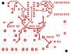

# Texecom Remote Power Reset

> **Project summary:** [`project-summary.html`](project-summary.html): one page with the
> reset timing, fail-safe behaviour, schematic, PCB layers, parts and bench tests.
> [View it rendered](https://htmlpreview.github.io/?https://github.com/jd710313/texecom-power-reset/blob/main/project-summary.html)
> (GitHub shows `.html` files as source), or download the file and open it in a browser.

A single board with an ESP32-C3 (Tasmota) and two on-board relays. It sits
inside a Texecom Premier Elite 64-W housing and can remotely "hard power
reset" the panel by briefly cutting both its battery and 16VAC feeds.

> **Status:** Design rev A with **on-board relays**. Schematic done (ERC clean,
> netlist verified). **PCB rev A routed: DRC clean (0 violations, 0 unconnected)**,
> GND pour on the bottom only, with an **engraved top legend** (`Mill_Legend`).
> Gerbers + drill + legend in `fab/`. Not yet milled or tested.

## Background

The panel occasionally raises an **"AUX 12V output failed"** fault. The only
way to clear it is to remove *all* power (battery and AC) and let the panel
restart. This board lets you do that remotely from Home Assistant.

The root cause (probably an overloaded or tripping AUX output) is being
investigated separately. This board is a remote recovery tool, not a fix.

## Requirements

### Panel

| # | Requirement |
|---|-------------|
| R1 | Panel: **Texecom Premier Elite 64-W** (built-in Ricochet wireless) |
| R2 | Firmware: **V6.05.03LS1** |
| R3 | Panel-side events after a reset (AC/battery fault logs, re-arming, etc.) are **out of scope**. They are handled manually. |
| R4 | AC presence and battery voltage are **already monitored** in Home Assistant through the Texecom integration, so this board doesn't monitor them. |

### Function

| # | Requirement |
|---|-------------|
| F1 | Remotely perform a "hard power reset" of the panel by cutting both the **battery 12V** feed and the **16VAC** feed at the same time. |
| F2 | Off duration: about **3 seconds** (Tasmota `PulseTime 30`). |
| F3 | Controlled from **Home Assistant over WiFi**, and reachable at all times. |
| F4 | The controller must **stay powered** while both panel feeds are cut. |

### Fail-safe

| # | Requirement |
|---|-------------|
| S1 | Panel feeds run through the relays' **NC (normally closed)** contacts. Coils are energised only during a reset, so a dead or unpowered board leaves the panel powered. |
| S2 | **Software timeout:** Tasmota `PulseTime`, so the relays release by themselves even if WiFi drops mid-reset. |
| S3 | **Hardware timeout:** a circuit between each GPIO and relay driver limits the maximum on-time (target about 5–10 s). This covers a firmware hang with the GPIO stuck high, and boot-time GPIO glitches. |

### Power

| # | Requirement |
|---|-------------|
| P1 | Powered from the **12V lead-acid battery only**, about 7.2Ah, tapped *before* the battery relay so it is never switched off. |
| P2 | The whole system is backed by **solar**, so no low-battery cutoff is needed. |
| P3 | Regulator: **Pololu S9V11E2F5** (5V buck-boost, 2–16V in, under 0.2mA quiescent). It supplies 5V to the ESP32-C3 SuperMini (5V pin), the 74HCT4538 and the relay coils. |
| P4 | Regulator input is **16V absolute max**. The battery floats at about 13.7V. The board adds **reverse-polarity protection**, a **bulk input capacitor** (≥33µF; 100µF used) and **transient protection**. |
| P5 | The battery tap on the board gets its **own small fuse** (about 0.5–1A, sized for the board's load). |
| P6 | Low power: Tasmota dynamic `Sleep` (WiFi stays connected). Target about 10–15mA average from the battery. |

### Hardware

| # | Requirement |
|---|-------------|
| H1 | MCU: **ESP32-C3 SuperMini**, socketed on female headers. |
| H2 | Relays: **2 × Songle SRD-05VDC-SL-C on the main PCB** ([Micro Robotics](https://www.robotics.org.za/SRD-5VDC-SL-C)). 5V coil (about 70mA each), contacts 10A at 30VDC / 250VAC, SPDT. Only COM and NC are used. |
| H3 | Each relay has a **transistor driver** (2N2222A), a **flyback diode** (1N4007) and a **red indicator LED** that lights while the coil is energised. |
| H4 | **Single board:** all field wiring lands on the PCB (battery in, battery out to the panel, 16VAC in, 16VAC out to the panel). There is no board-to-board wiring. |
| H5 | Screw terminals: **KF301-2P** (already on hand). 5.0mm pitch, 16A, 250V, 22–14 AWG, side entry, interlocking. Four are used (J1–J4). |
| H6 | **Custom PCB** (KiCad) holding the SuperMini socket, the S9V11E2F5, the 74HCT4538 hardware timeout, the relay drivers, both relays, the battery input protection and fuse, and J1–J4. |
| H7 | Everything must fit **inside the panel housing**. Rev A board is **92 × 70mm**; the relays are the tallest part (about 15.5mm). |
| H8 | The PCB is **CNC-milled in-house**, **double-sided** (FlatCAM with alignment pins, 30° V-bit with 0.1mm tip, 0.7mm tracks proven), from on-hand copper-clad board. There are **no plated through-holes, no solder mask and no silkscreen**. |

## Parts on hand

| Part | Source | Status in this design |
|------|--------|-----------------------|
| ESP32-C3 SuperMini | n/a | U3 |
| KF301-2P screw terminals, 5mm (10-pack) | [Micro Robotics](https://www.robotics.org.za/KF301-2P) | J1–J4. **Suitable:** rated 16A / 250V, against about 1.6A max on the battery path and a 16VAC supply. |
| Capacitor kit (CAPKIT) | [Micro Robotics](https://www.robotics.org.za/CAPKIT) | C1 (100µF), C2/C4/C7/C8 (100nF), C3 (10µF) |
| Female and male headers, heat shrink, bootlace ferrules | n/a | SuperMini socket, Pololu header, wiring |
| REL-2CHAN-335V relay module | [Micro Robotics](https://www.robotics.org.za/REL-2CHAN-335V) | **No longer used** (replaced by on-board relays). Kept as a spare and for bench tests. |

## Wiring concept

```
                  ┌─────────────────────────── Main PCB ───────────────────────────┐
Battery +  ──► J1 BAT IN + ──┬──────────────────────────► K1 COM ─┐  NC            │
                             │                                    └──────► J2 BAT OUT + ──► Panel BATT +
                             └─ F1 → D1 → Pololu 5V → ESP32-C3, 74HCT4538, relay coils │
Battery −  ──► J1 BAT IN − ───── GND ─────────────────────────────────► J2 BAT OUT − ──► Panel BATT −
                                                                                       │
16VAC ~A   ──► J3 AC IN ~A ───────────────────────────► K2 COM ─┐  NC                  │
                                                                └──────► J4 AC OUT ~A ──► Panel AC ~A
16VAC ~B   ──► J3 AC IN ~B ───────────────────────────────────────────► J4 AC OUT ~B ──► Panel AC ~B
                  └────────────────────────────────────────────────────────────────┘
```

Each panel power path passes through **only two screw terminals** (in and out)
and one relay contact.

## Panel facts (Texecom INS176-15 installation manual)

From the *Premier Elite 12-W, 24-W & 48/64-W* sections:

| Item | Value |
|------|-------|
| Battery fuse | **F6, 1.6A electronic PTC** |
| AUX 12V, Digicom, Network 1, Bell/Strobe fuses | 0.9A electronic PTC each |
| Panel current consumption | 150mA |
| Maximum current available | 1.0A, plus 0.3A battery charge (7Ah setting) |
| **Battery kick-start** | "The panel will only become live when the AC Mains is connected or the Battery Kick-start button is pressed." |
| Power-up order | Connect the battery first, then AC. |
| Troubleshooting | "Remove ALL power (AC Mains and Battery) and then reapply", which is the same procedure this board automates. |

**Relay rating check:** each relay path carries at most about 1.6A (the battery PTC
limit) or the panel's AC input current. The SRD-05VDC-SL-C contacts are rated
10A. **OK.**

**Kick-start consequence:** the panel only restarts after a reset if **AC is
present**. A reset during a real AC outage would leave the panel **off** until
someone presses the kick-start button. The Home Assistant script therefore
checks that AC is present before it resets (see below).

---

## Design: rev A (on-board relays)

### Block diagram

```
 Battery + ─J1─┬─ F1 PTC ─ D1 ─┬─ C1/C2/D2 ─ U1 Pololu ─► +5V ─┬─ D3 ─► SuperMini 5V
               │               │  bulk/TVS                   ├─► U2 74HCT4538 VCC
               │               │                             └─► relay coils, LEDs
               └───────────────┼──────────────► K1 COM ─ NC ─► J2 BAT OUT +
                               │
 GPIO4 ─ R9 1k ─┬─ reset ─┐                                          +5V
                └─ RC ────┴─► U2 ch1 (7 s max) ─ Q ─ R7 1k ─► Q1 2N2222A ─► K1 coil ┤ D4 flyback, D6 LED
 GPIO3 ─ R10 1k ─┬─ reset ─┐                                         +5V
                 └─ RC ────┴─► U2 ch2 (7 s max) ─ Q ─ R8 1k ─► Q2 2N2222A ─► K2 coil ┤ D5 flyback, D7 LED

 J3 AC IN ~A ─► K2 COM ─ NC ─► J4 AC OUT ~A        J3 ~B ─► J4 ~B (straight through)
```

### 1. Power input and protection

| Ref | Part | Purpose |
|-----|------|---------|
| J1 | KF301-2P screw terminal | BAT IN (+/−). The power supply taps J1+ on the PCB, **before** the relay path, so it is never switched. |
| F1 | **Resettable PTC fuse**, 1206 SMD, 0.5A hold / 1A trip, 24V (Micro Robotics PTC05A24V) | Protects the board's battery branch (not the panel's battery path). The board draws about 0.25A peak at 12V. After a short, it trips, then resets by itself once the fault is removed. |
| D1 | 1N5822 Schottky (DO-201AD, 3A 40V), in series | Reverse-polarity protection (about 0.3V drop, negligible at about 15mA). |
| C1 | 100µF 35V radial electrolytic | Damps LC spikes from the battery leads, as Pololu recommends for the S9V11 (at least 33µF). |
| C2 | 100nF ceramic (radial, 5.08mm) | High-frequency decoupling. |
| D2 | P6KE18A TVS (DO-15) | Clamps larger transients. Its 15.3V standoff sits above the 13.8V float voltage, so no leakage. It is a last line of protection; C1 is the main LC-spike damper. |
| U1 | **Pololu S9V11E2F5** on a 1×4 header | 5V buck-boost, under 0.2mA quiescent. EN is left open (internal pull-up means always on). |
| C3 | 10µF 50V radial electrolytic | Output decoupling. |
| D3 | 1N5822 Schottky between +5V and SuperMini 5V | **Blocks USB backfeed.** The SuperMini's USB VBUS is tied straight to its 5V pin, so plugging in USB would otherwise push 5V from USB onto the relay coils and the Pololu output. The SuperMini still gets about 4.7V, which is fine for its 3.3V LDO. |

**Current budget (estimated):**

| State | 5V rail | From battery (at 13.6V, about 88% efficiency) |
|-------|---------|------------------------------------------|
| Idle, WiFi connected, Tasmota `Sleep` | about 25–35mA | **about 11–15mA** (0.3Ah/day, solar-backed) |
| Reset (both relays and LEDs on for 3 s) | about 150mA + ESP | about 90mA for 3 s |
| Worst-case peak (WiFi TX + relays) | about 0.5A | about 0.25A |

### 2. Controller: ESP32-C3 SuperMini

- Plugs into **two 1×8 female headers**, so it can be removed for flashing or
  replacement.
- Relay control pins: **GPIO4 → channel 1 (K1, battery)** and **GPIO3 →
  channel 2 (K2, AC)**. (Swapped from the first draft when the SuperMini
  footprint was corrected; this pairing keeps the tracks from crossing.)
  - Neither is a strapping pin (unlike GPIO2, 8 and 9), nor a USB pin (18, 19)
    or the UART0 pin that prints the boot log (GPIO21).
  - Both are plain inputs with **no internal pull-up at reset** (ESP32-C3
    datasheet, Table 2-1), so they can't pulse a relay while the ESP boots.
    GPIO6 (MTCK) and GPIO9 do have a weak pull-up at reset and are avoided.
- R1 and R2: **100k pull-downs** on the 74HCT4538 side of R9/R10. They hold the
  resets low (relays off) while the ESP is booting, unpowered or removed.
- R9 and R10: **1k series resistors** between each GPIO and the 74HCT4538.
  They protect the ESP when the 5V rail is off. See the note in §3.
- The V2 SuperMini's onboard LED is a **WS2812 RGB LED on GPIO8** (a strapping
  pin). It isn't used as a status LED; leave GPIO8 unassigned in Tasmota.
- **Orientation:** the module mounts **component (button) side up** with its
  **USB-C at the right-hand board edge** (engraved "USB →" on the legend), so it
  can be flashed in place. The antenna end therefore points into the board,
  about 8.5mm above the copper on the header sockets. If WiFi is weak inside the
  panel housing (especially a metal one), use the V2's **IPEX external-antenna
  option** (move the small antenna-select link as described on the module's
  info page) and fit the optional 2.4GHz antenna from the BOM (Communica, IPEX
  on a lead).

### 3. Hardware timeout: 74HCT4538 dual monostable (at 5V)

One chip (**TI CD74HCT4538E**, DIP-16) covers both channels. Each channel behaves as:

> **relay on = GPIO high AND less than T seconds since the GPIO went high**

| GPIO behaviour | Relay |
|----------------|-------|
| Normal 3 s `PulseTime` pulse | On for 3 s (T is longer, so it never cuts a normal pulse short) |
| GPIO stuck **high** (firmware hang mid-reset) | Released after **T about 5–9 s (7 s nominal)**. It cannot re-trigger without a new low-to-high edge. |
| GPIO low or floating (crash, reboot, ESP removed) | Released immediately, because the reset input R is low |
| Short boot glitch high | Only as long as the glitch (µs), so the relay doesn't respond |
| 5V lost | 74HCT4538, drivers and relay coils all unpowered, relay released |

**Why a 74HCT at 5V (not a 74HC at 3.3V):** it runs from the same 5V rail as the
relay drivers, and it gives a full 5V drive to the transistor bases. HCT inputs
use TTL thresholds (**high = 2.0V or above**, low = 0.8V or below), so the ESP's
3.3V GPIO drives them reliably. (It was chosen originally when bench test 1b
showed the relay *module's* input needed 4.77mA; with on-board relays the choice
still stands.)

**Wiring for each channel.** TI pin names are used here; Nexperia's datasheet
swaps the letters A and B, but the **pin numbers and functions are identical**.

| CD74HCT4538 pin (ch1 / ch2) | Connection |
|-----------------------|-----------|
| R 3 / 13 (active-low reset) | Node N: GPIO through **R9/R10 1k**, with **R1/R2 100k** pull-down to GND at the chip side |
| A 4 / 12 (leading-edge / rising trigger) | Node N through **R5/R6 10k**, with **C7/C8 100nF** to GND. The 1ms delay makes sure reset is released **before** the trigger edge arrives. The Schmitt input handles the slow edge. |
| B 5 / 11 (trailing-edge trigger) | Tied to **VCC** (TI: "an unused B should be tied to VCC") |
| CX 1 / 15 | GND |
| RXCX 2 / 14 | REXT **R3/R4 1M** to +5V. CEXT **C5/C6 10µF X5R 1206** to GND through **R11/R12 100Ω** in series (TI's rapid power-down protection, Fig. 13). |
| Q 6 / 10 | Relay driver: **R7/R8 1k** to the Q1/Q2 base (§3a) |
| Q̅ 7 / 9 | Not used |
| VCC 16 | +5V, with **C4 100nF** decoupling |
| GND 8 | GND |

**Timing:** T = 0.7 × REXT × CEXT = 0.7 × 1M × 10µF ≈ **7 s nominal** (TI
datasheet: τ = 0.7·RX·CX, RX min 5k; noise susceptibility "may occur for
RX > 1M", so 1M is the upper limit). It needs to stay above 3.5 s (the longest
`PulseTime`) and, ideally, below 30 s. **Bench test 3** confirms the real value.
Tune it by lowering REXT or changing CEXT. Keep the RXCX traces short.

- **CEXT must be low-leakage.** With REXT at 1M the timing current is only about
  5µA, so an aluminium electrolytic (leakage in the µA range) would upset the
  timing badly. Use an **X7R/X5R ceramic**. Avoid **Y5V** ceramics, which can
  lose 50–80% of their capacitance.
- **Power-down protection:** TI requires protection when CX is 0.5µF or more.
  The 100Ω in series with CX limits the discharge current into pins 2/14 if 5V
  collapses quickly.
- **Use 74HCT4538** (TI CD74HCT4538E from Communica). A 74HC4538 won't reliably
  read 3.3V inputs at 5V, and a CD4538 has too little output drive.

**ESP protection (does 5V reach the ESP?):** no. The ESP pins only drive the
74HCT4538's **inputs**, which are high-impedance CMOS gates. No 5V output
connects to any ESP pin, so the ESP never sees more than its own 3.3V.

The one corner case is the **5V rail being off while the ESP is powered**, for
example on USB for flashing (D3 blocks USB from the 5V rail). If the ESP then
drives a GPIO high, current could flow through the chip's input clamp diode into
the unpowered 5V rail. **R9/R10 (1k)** limit that to under 3mA, which is harmless
for both parts. They cost nothing in normal operation, because the HCT inputs
draw no current.

### 3a. Relay drivers and relays

| Ref (ch1 / ch2) | Part | Purpose |
|-----------------|------|---------|
| R7 / R8 | 1k, 1206 | Base resistor: (5V − 0.75V) / 1k ≈ **4.3mA** base current, within the 74HCT4538's 4mA-class output rating |
| R13 / R14 | 10k, ¼W | Base pull-down: keeps the transistor off if U2 is unpowered or removed from its socket |
| Q1 / Q2 | **2N2222A**, TO-92 | Low-side coil switch. Coil current about 72mA; forced gain about 17, so the transistor is fully saturated. |
| K1 / K2 | **SRD-05VDC-SL-C** | K1 switches the battery (J1 → COM, NC → J2); K2 switches 16VAC ~A (J3 → COM, NC → J4). NO contacts unused. |
| D4 / D5 | **1N4007** | Flyback diode across each coil (cathode to +5V) |
| R15 / R16 + D6 / D7 | 1k, 1206 + **red 3mm LED** | Across each coil: lights (about 3mA) while that relay is energised, that is while the panel feed is **cut** |

**Relay pin-out (KiCad Relay_SPDT_SANYOU_SRD_Series_Form_C, matches the Songle SRD):**
1 = COM, 4 = NC, 3 = NO, 2 and 5 = coil.

**2N2222A pin-out warning:** TO-92 2N2222A parts are usually **E-B-C**, but
some makers use other orders. The footprint is TO-92 inline with pin 1 = E,
2 = B, 3 = C. **Check the pin-out of the actual transistors** before soldering.

**Fail-safe chain:** GPIO low / ESP dead → U2 reset low → Q low → R13/R14 hold
the base low → coil off → **NC closed** → panel powered. U2 unpowered or pulled
from its socket gives the same result.

### 4. Connectors

**Screw terminals:** all **KF301-2P** (5.0mm pitch, 16A / 250V, 22–14 AWG).

| Ref | Label (engraved) | Pin 1 | Pin 2 | Wires to |
|-----|-------------------|-------|-------|----------|
| J1 | BAT IN | + | − | Battery |
| J2 | BAT OUT | + | − | Panel BATT terminals |
| J3 | AC IN | ~A | ~B | 16VAC supply |
| J4 | AC OUT | ~A | ~B | Panel AC terminals |

### 5. Field wiring

| From | To |
|------|-----|
| Battery + / − | J1 BAT IN + / − |
| J2 BAT OUT + / − | Panel BATT + / − (the panel's original battery leads) |
| 16VAC supply ~A / ~B | J3 AC IN ~A / ~B |
| J4 AC OUT ~A / ~B | Panel AC terminals |

**Wire:** 0.5–0.75mm² (20–18 AWG) for the battery and AC runs, with ferrules in
the screw terminals.

**Recommended:** an in-line fuse (about 3A) on the battery + lead, close to
the battery. The battery current now runs through the PCB, and a 7Ah SLA
battery can deliver very high currents into a short before the panel's own F6
PTC (which sits downstream) can do anything.

### 6. PCB

- 2-layer, **about 70 × 50mm** (estimated): two relays (19 × 15.5mm each) in,
  and the relay module, J5, J6, J7 and the control lead out. The housing
  dimensions are still open.
- **Placement:** J1–J4 along one edge with K1/K2 right behind them, so the
  battery and AC paths are short. The SuperMini sits at the opposite edge,
  as far from the relays as possible, with its USB-C at the board edge.
- **Heavy-current traces** (J1 → K1 → J2, J3 → K2 → J4, and the BAT− and AC ~B
  straight-throughs): at least **2mm wide** on 1oz copper (about 3A at
  10°C rise), or copper pours.
- **Clearance:** the 16VAC lines swing about ±23V relative to GND (the
  panel's bridge rectifier references them to 0V). Keep at least 1mm from logic
  traces. This is low voltage, so no mains-level creepage is needed.
- **Footprint pitch:** the KF301 is 5.0mm. Use a 5.0mm footprint (not 5.08mm)
  so that interlocked blocks line up.
- **Through-hole wherever possible:** axial resistors and diodes, radial
  capacitors, TO-92, DIP-16 in a socket, 2.54mm headers. **1206 SMD is
  acceptable** (hand-solderable) and is used for F1, C5/C6 and several resistors.
- GND pour on the **bottom layer only**. The top
  layer carries only tracks, pads and the engraved legend (§6a).
- 2 × M3 mounting holes.

### 6a. CNC-milling rules (H8)

**Process:** KiCad → Gerbers + Excellon drill → **FlatCAM** (isolation and drill
G-code) → CNC. **Double-sided**, with FlatCAM flip alignment using **alignment
pins**. Tool: **30° V-bit, 0.1mm tip**. The machine has milled 0.7mm tracks
reliably (see the example board), and all common drill sizes are available.

Milled boards have **no plated through-holes, no solder mask and no
silkscreen**, so the layout follows these rules:

| Rule | Why |
|------|-----|
| **Double-sided, but a top-layer connection is only allowed on pads that can be soldered on top.** Axial resistors and diodes, and radial capacitors and LEDs mounted slightly raised, can be soldered on top. The IC socket, female headers, male header under the Pololu, relays, TO-92 transistors (usually) and KF301 terminals **cannot**, because their bodies cover the top pads. | There's no plating to carry a top trace to a bottom joint. |
| **Enforced in KiCad:** the footprints of the covered parts get **bottom-copper-only pads**, so neither manual routing nor the autorouter can connect to them on top. | Makes the rule impossible to break by accident, including by the autorouter. |
| **Vias** are drilled and fitted with a **wire link soldered on both sides.** Keep them few (target 10 or fewer), with 0.8mm drill and 2.0mm pads. **0Ω links** (RES-0E-50) can also serve as crossings. | Every via is a manual solder job. |
| **1206 SMD parts go on the bottom side.** | They're soldered on the same side as the through-hole joints. |
| **Traces 0.7mm by default** (proven on this machine; 0.6mm minimum where needed), **clearance at least 0.4mm**. Power paths at least 2mm, and 16VAC traces at least 1mm from logic. | Proven geometry for the 30°/0.1mm V-bit |
| **Oval, oversized pads** (for example 2.0 × 3.0mm for 0.8–1.0mm holes, bigger for terminals, relays and the 1N5822s). | User's standard practice for easy hand soldering |
| **Extra clearance around pads:** a custom KiCad rule of **at least 0.8mm from any pad to other copper** (tracks at 0.4mm to each other), plus **component spacing** that keeps neighbouring pads and bodies well clear. | The user prefers wider isolation around pads for easy hand soldering and no solder bridges. FlatCAM's multi-pass isolation needs room to widen the cut around pads without eating into neighbouring traces. |
| **Drill sizes:** 0.8mm (resistors, small capacitors, LEDs, TO-92, vias), 1.0mm (headers, IC socket, 1N4007, 0Ω links), 1.3–1.5mm (KF301, relay pins, 1N5822 at 1.3mm leads, C1), 3.2mm (M3 mounting holes). | Few tool changes |
| **GND pour on the bottom only.** The top layer has no pour; its unused copper stays as floating copper and carries the engraved legend. | Faster milling and good grounding on the bottom. A top pour would reach pads that can't be soldered on top, and it would leave nowhere to engrave the legend. |
| **SuperMini USB-C at the board edge** (antenna end inward). | Flashing in place, and it let the corrected footprint keep the proven routing. Use the V2's external-antenna option if WiFi is weak. |
| **Legend engraved into the top copper** from the `Mill_Legend` layer (User.1): part outlines, polarity and pin-1 marks, references, the terminal labels BAT IN / BAT OUT / AC IN / AC OUT with + / − on the battery terminals, and a small **ring beside every pad that must be soldered on top** (key: "○ = SOLDER TOP"). The rings are placed so each one is clearly nearest its own pad. Generated so every line stays **at least 0.35mm clear of any top copper feature or hole** (plus half the line width), so an engrave can never cut a track or pad. | No silkscreen. The legend shows where each part goes. |
| After testing, **coat the board** (conformal coat or clear lacquer). | No solder mask, and the board lives in the panel for years. |

**Routing:** I place the parts and then try routing. If that's poor, use the
user's preferred autorouter, the **KiCad routing tools (Go implementation)**, with
the rules above as design rules.

### 6b. KiCad project

| File | Contents |
|------|----------|
| `texecom-power-reset.kicad_pro` / `.kicad_sch` | Project and schematic (A3, single sheet). **Drawn with wires**; only GND, +5V and +5V_MCU use power symbols or labels. |
| `texecom-power-reset-schematic.pdf` | Schematic PDF export |
| `texecom-power-reset.kicad_sym` | Project symbols: ESP32-C3-SuperMini (from the esp32c3-button-led project), Pololu_S9V11E2F5 |
| `texecom-power-reset.pretty/` | Project footprints: ESP32-C3-SuperMini (**pin rows corrected 2026-09-25**: the first version was mirrored, which would have put 5V and GND on GPIO5/GPIO6 with the module button side up), Pololu_S9V11E2x (pin order VOUT, GND, VIN, EN per the Pololu drawing) |
| `backup/` | Earlier schematic versions (label-connected, and wired with the off-board relay module), kept for reference only. **Not** used for the PCB. |
| `project-summary.html` | One-page visual project summary (self-contained HTML, open in a browser) |
| `fab/` | **Reference export** (maintained with the design): Gerbers F.Cu / B.Cu / Edge.Cuts / Mill_Legend, Excellon drill, drill map |
| `kicad-output/` | Working KiCad output folder used for milling (Gerbers, drill and anything else needed) |
| `flatcam/` | FlatCAM work: project files and generated G-code |
| `docs/` | Copper renders (top includes the legend), 3D renders and the assembly drawing |
| `tools/make_legend.py` | Regenerates the `Mill_Legend` engrave layer, kept clear of all top copper |

**Layout:** power path across the top. **Channel 2** (GPIO3, K2 AC relay) is in
the middle band and **channel 1** (GPIO4, K1 battery relay) in the lower band.
This order avoids wire crossings from the SuperMini. J3/J4 (AC) sit next to K2,
and J2 (BAT OUT) next to K1. The BAT_IN+ wire runs from J1 over the top and down
the right side to K1 COM.

**Reference designators** match BOM.md: U1 Pololu, U2 74HCT4538 (units A/B =
channels 1/2, unit C = power), U3 SuperMini, J1–J4 KF301 terminals, K1/K2
relays, Q1/Q2 2N2222A, F1 PTC, D1/D3 1N5822, D2 P6KE18A, D4/D5 1N4007,
D6/D7 LEDs, C1–C8, R1–R16, MH1/MH2 M3 holes.

**Verification:** ERC 0 errors, 0 warnings. The KiCad netlist was checked net
by net against the intended circuit (32 nets). The only unconnected pins are the
intentional ones (relay NO, Q̅ outputs, Pololu EN, unused SuperMini pins).

### 6c. PCB layout (rev A)




| Item | Value |
|------|-------|
| Board | **92 × 70mm**, 2 layers, 2 × M3 holes (top-left, bottom-right) |
| Placement | Terminals along the bottom edge: **J4 AC OUT, J3 AC IN, J2 BAT OUT, J1 BAT IN** (left to right). K2 (AC) above J4/J3, K1 (battery) above J2/J1. Drivers and LEDs above the relays, 74HCT4538 top-middle, SuperMini top-right (button side up, **USB-C at the right-hand edge**, antenna end pointing inward), power section bottom-right. |
| Routing | KiCad routing tools (drandyhaas), with a milling floor: **0.8mm clearance** everywhere (1.0mm for 16VAC), 0.7mm signal tracks, 1.0mm supply tracks, 2.0mm battery/AC tracks. GND by a **bottom-layer pour only**, plus a few GND tracks. |
| Vias | **16 wire-link vias** (0.8mm drill, 2.0mm pad): solder a short wire on both sides. |
| Legend | `Mill_Legend` layer (User.1), engraved into the top copper with the V-bit. See *Engraving the legend* below. |
| DRC | **0 violations, 0 unconnected** against the project rules (`.kicad_pro` net classes + `.kicad_dru`). |
| Fab files | `fab/`: `texecom-power-reset-F_Cu.gbr`, `-B_Cu.gbr`, `-Edge_Cuts.gbr`, `-Mill_Legend.gbr` (legend engrave), `texecom-power-reset.drl` (Excellon, mm, absolute origin; PTH and NPTH merged), drill map PDF. |

**Drill sizes:**

| Drill | Holes | Used for |
|-------|-------|----------|
| 0.8mm | 66 | Resistors, disc caps, electrolytics, TO-92, DIP socket, the 16 vias |
| 0.9mm | 4 | LEDs |
| 1.0mm | 30 | SuperMini and Pololu headers, 1N4007/P6KE18A, relay coil pins |
| 1.3mm | 14 | KF301 terminals, relay contact pins |
| 1.5mm | 4 | 1N5822 (1.3mm leads) |
| 3.2mm | 2 | M3 mounting holes |

**How the "no top joint on covered pads" rule is enforced** (so the router can't
create a connection that can't be soldered):

- KiCad forces plated pads onto both copper layers, so the covered footprints
  (terminals, relays, DIP socket, headers, TO-92, electrolytics, LEDs) carry a
  **per-pad F.Cu keepout** (no tracks, no vias, no pour) inside the footprint.
  These are in the `*_Mill` footprints in `texecom-power-reset.pretty/`.
- There is **no top pour** at all. The `.kicad_dru` rule **"no top pour on
  covered pads"** (`zone_connection none` on F.Cu) is kept as a guard in case a
  top pour is ever added again. DRC connectivity is therefore honest: every
  connection it counts is solderable.

**Assembly notes for the milled board:**

1. **Vias:** fit a wire through each of the 16 vias and solder both sides first.
2. **SMD (1206) parts are on the bottom** (F1, C5, C6, R7–R12, R15, R16): solder
   them first, on the bottom.
3. **Axial parts and disc capacitors** (R1–R6, R13, R14, D1–D5, C2, C4, C7, C8):
   mount them **1–2mm off the board** so the iron can reach the top pads, and
   **solder every pad on both sides**. The holes aren't plated, so the top and
   bottom pads are only joined by solder on the lead. Twenty of these pads carry
   a top track, and for those the top joint is **essential** (some have no
   bottom track at all). They're marked on the board with a small engraved
   **ring (○ = SOLDER TOP)** next to the pad. Soldering the other top pads is
   harmless and keeps the rule simple.

   | Part | Type | Pads with a top track | Net |
   |------|------|-----------------------|-----|
   | R1 | Axial resistor | 1, 2 | U2A reset, GND |
   | R2 | Axial resistor | 1 | U2B reset |
   | R3 | Axial resistor | 1 | +5V |
   | R4 | Axial resistor | 1 | +5V |
   | R5 | Axial resistor | 1, 2 | U2A reset, U2A trigger |
   | R6 | Axial resistor | 1, 2 | U2B reset, U2B trigger |
   | R13 | Axial resistor | none | |
   | R14 | Axial resistor | 2 | GND |
   | D1 | Axial diode (1N5822) | 1 | D1 cathode |
   | D2 | Axial diode (P6KE18A) | 1 | D1 cathode |
   | D3 | Axial diode (1N5822) | none | |
   | D4 | Axial diode (1N4007) | 1, 2 | +5V, D4 anode |
   | D5 | Axial diode (1N4007) | 1 | +5V |
   | C2 | Disc capacitor | 1 | D1 cathode |
   | C4 | Disc capacitor | 1, 2 | +5V, GND |
   | C7 | Disc capacitor | 1 | U2A trigger |
   | C8 | Disc capacitor | 1 | U2B trigger |

   Solder the top joint first, then the bottom. Afterwards, check continuity
   from each ringed pad to the far end of its top track.
4. **Everything else** (terminals, relays, socket, headers, TO-92s, electrolytics,
   LEDs) is soldered on the **bottom only**; their top pads are isolated rings.
   - **SuperMini (U3):** solder male pins to the module and two 1×8 female
     headers to the board (bottom side). Plug the module in **button side up,
     USB-C towards the right-hand board edge**, following the engraved
     "USB →" arrow. Before plugging it in, check that the square pad (pin 1,
     5V) is at the USB end of the row nearest the relays.
5. After testing, coat the board (no solder mask).

**Engraving the legend (FlatCAM):**

1. Load `fab/texecom-power-reset-Mill_Legend.gbr` together with the F.Cu
   Gerber. It shares their origin, so it lines up with the top isolation and
   the alignment pins.
2. On the legend Gerber object, create a **Follow** geometry (it cuts along the
   centre of each 0.15mm line instead of isolating around it).
3. Create a CNC job with the 30° V-bit at a **shallow depth, about −0.06mm**
   (just through 35µm copper, giving a line about 0.13mm wide). Run it after the
   top isolation, with the board still clamped in the same top-side setup.
4. The legend was generated clear of everything on the top copper, so it only
   ever cuts floating (unconnected) copper. If you change the layout, regenerate
   it with `tools/make_legend.py` (run with KiCad's Python; see the script header)
   rather than editing it by hand.

### 7. Tasmota configuration

Build: `tasmota32c3.bin` (flash through the SuperMini's USB-C, with the board
unpowered from the battery; D3 isolates USB from the relay rail).

`Configuration → Configure Module` (Generic ESP32-C3):

| GPIO | Function |
|------|----------|
| GPIO4 | Relay 1 (battery, K1) |
| GPIO3 | Relay 2 (AC, K2) |
| GPIO8 | None (WS2812 RGB LED and strapping pin; leave unassigned) |

Console:

```
Backlog PowerOnState 0; PulseTime1 30; PulseTime2 35; Sleep 100; FriendlyName1 Panel Battery Cut; FriendlyName2 Panel AC Cut
```

| Setting | Why |
|---------|-----|
| `PowerOnState 0` | Relays are **always off** after an ESP reboot or power-up. |
| `PulseTime1 30` | Battery cut for 3.0 s. |
| `PulseTime2 35` | AC cut for 3.5 s. Battery comes back first, then AC, which matches the manual's power-up order. The panel goes live when AC returns. |
| `Sleep 100` | Dynamic sleep for lower average current while WiFi stays connected. |

If the SuperMini has trouble holding a WiFi connection (a known issue with some
SuperMini antenna layouts), try `WifiPower 8.5`. On this board the antenna end
points inward over the PCB, so if the signal inside the panel housing is poor,
switch the V2 to its IPEX external antenna.

### 8. Home Assistant script (example)

Entity IDs are placeholders. Adjust them, and the AC-OK condition, to match the
Tasmota and Texecom integrations.

```yaml
script:
  texecom_hard_power_reset:
    alias: "Texecom hard power reset"
    mode: single
    sequence:
      # Never reset without AC: the panel would not restart without the kick-start button.
      - condition: state
        entity_id: binary_sensor.texecom_ac_ok        # placeholder
        state: "on"
      - action: switch.turn_on
        target:
          entity_id:
            - switch.texecom_reset_panel_battery_cut   # placeholder
            - switch.texecom_reset_panel_ac_cut        # placeholder
```

### 9. Bench tests before installing

Do these with a bench supply of about 12–13.8V on J1, **before** connecting
the panel.

1. **Power-up:** the +5V rail reads 4.9–5.2V, both LEDs stay **off**, and both
   relays stay released. The NC contacts show continuity: J1+ to J2+, and
   J3 ~A to J4 ~A.
2. **Normal pulse:** turn on `Power1`. K1 clicks, D6 lights, and J1+ to J2+ opens
   for 3.0 s, then everything releases. Repeat with `Power2` (K2, D7, 3.5 s).
3. **Hardware timeout:** set `PulseTime1 0` (no software timeout) and turn on
   `Power1`, so the GPIO stays high. K1 should release after about 5–9 s
   (7 s nominal) and stay off. Afterwards, restore `PulseTime1 30`. Repeat for
   channel 2.
4. **Fail-safe:** unplug the SuperMini, and separately pull U2 from its
   socket. Both relays must stay released (NC closed) and the LEDs off.
5. **USB isolation:** with J1 disconnected, plug in USB. The relays, LEDs and
   +5V rail must **not** power up.
6. **Idle current:** measure the J1 current with WiFi connected. The
   target is about 15mA or less.

### Bill of materials

The full BOM and sourcing tracker (on hand / Micro Robotics / Communica) is in
**[BOM.md](BOM.md)**.

## Open items

- [ ] Free space inside the 64-W housing (dimensions still to come), including height for the relays (about 15.5mm)
- [x] ~~Panel fuse ratings~~: the battery fuse is 1.6A PTC, which is well within the 10A relay rating
- [x] ~~Relay module trigger polarity and 3.3V drive (tests 1a/1b)~~: done 2026-09-25 (high-level trigger, 4.77mA at 3.3V). No longer relevant, because the module was replaced by on-board relays.
- [x] ~~KiCad schematic~~: done with on-board relays, drawn with wires, ERC clean, netlist verified (2026-09-25)
- [ ] Check the pin-out of the 2N2222A transistors actually bought (E-B-C expected)
- [x] ~~PCB layout~~: rev A placed and routed, DRC clean, Gerbers and drill in `fab/` (2026-09-25)
- [ ] Mill, assemble and bench-test rev A (section 9)

## Decisions log

| Decision | Reason |
|----------|--------|
| Pololu S9V11E2F5 instead of the XL7015 | The XL7015 (5–80V, 150kHz, non-synchronous) is inefficient at light load and bulky. The S9V11E2F5 has under 0.2mA quiescent current, a light-load mode, and a 10.9 × 16.5mm footprint. |
| Battery-only supply (no 16VAC diode-OR) | Rectified 16VAC peaks at about 22–25V, above the S9V11E2F5's 16V max. Solar backing makes battery drain a non-issue. |
| No low-battery cutoff | The system is solar-backed. |
| No AC or battery monitoring on the board | Already provided by the Texecom integration in HA. |
| KF301-2P terminals (on hand) | Rated 16A / 250V and accepts up to 14 AWG, well above the 1.6A battery path and 16VAC. |
| Hardware timeout in addition to `PulseTime` | `PulseTime` is software and can't release a relay if the firmware hangs with the GPIO high. |
| 4538 monostable for the hardware timeout | One chip covers both channels. Its precise timing (0.7·R·C) beats a MOSFET-threshold RC, and its reset input gives "GPIO AND timer" logic without extra gates. |
| Battery restores 0.5 s before AC (`PulseTime1 30` / `PulseTime2 35`) | Matches the manual's power-up order (battery first, then AC). |
| HA script requires AC present | Without AC the panel won't restart unless the kick-start button is pressed. |
| D3 Schottky diode in the SuperMini 5V feed | The SuperMini's USB VBUS connects straight to its 5V pin. The diode stops USB from backfeeding the relay rail and regulator. |
| Through-hole parts wherever possible; 1206 SMD acceptable | User preference. 1206 is large enough to hand-solder. |
| F1 = PTC05A24V (1206, 0.5A hold) instead of the radial WDS250-500 (0.25A hold) | More margin over the peak load, and it's in stock at Micro Robotics. |
| CEXT 10µF X5R 1206 with REXT 1M | 22µF through-hole ceramics are hard to find. 10µF with 1M gives T ≈ 7 s. |
| 1N5822 for D1/D3 | Micro Robotics stocks the 1N5822, not the 1N5819. |
| Parts sourced from Micro Robotics (robotics.org.za) where possible | User preference. Tracked in BOM.md. The 74HCT4538 and the P6KE18A come from Communica. |
| **74HCT4538E at 5V** instead of 74HC4538 at 3.3V | Bench test 1b measured 4.77mA per relay-module input at 3.3V, too close to a 3.3V 74HC's drive limit. At 5V the HCT has margin, and its TTL input levels still accept 3.3V from the ESP. It also suits the on-board transistor drivers. |
| 1k series resistors (R9/R10) between the GPIOs and the 74HCT4538 | They limit the clamp-diode current if the ESP drives a GPIO high while the 5V rail is off (USB-only power). |
| 100Ω in series with CEXT (R11/R12) | TI's recommended rapid power-down protection for CX of 0.5µF or more, without adding diode leakage across the 1M timing resistor. |
| Kept the Pololu S9V11E2F5 over the on-hand XL4015 and MP4560 modules | XL4015: too large (54 × 23 × 18mm), high idle current, trimpot output. MP4560: acceptable (55V input, pulse skipping), but its trimpot output could drift and over-voltage the ESP, 74HCT4538 and relays. The Pololu has a fixed 5V output and under 0.2mA idle current. |
| Schematic drawn with wires (not only net labels) | Readability. Only GND, +5V and +5V_MCU use power symbols or labels. |
| **On-board SRD-05VDC-SL-C relays instead of the REL-2CHAN-335V module** | Each panel power path drops from 4 screw terminals plus 2 wires to **2 terminals**. A loose connection there would silently cut the panel's battery or AC. It also removes the inter-board wiring, the crimped control lead, J5–J7, the Q/Q̅ links and R7/R8 (220Ω). The cost is a board about 70 × 50mm and a few cheap driver parts. |
| 2N2222A + 1k base + 10k pull-down + 1N4007 flyback per relay | Standard low-side driver, all in stock at Micro Robotics. The pull-down keeps the relay off if U2 is unpowered or removed. |
| Red LED + 1k across each coil | Shows at a glance which feed is being cut (it replaces the module's indicator LEDs) and helps with bench testing. |
| Per-pad F.Cu keepouts in the covered footprints (not NPTH + bottom SMD pads) | KiCad forces plated pads onto both layers. Modelling the pads as NPTH + B.Cu SMD made the router treat each hole as an obstacle to its own pad. Keepouts inside the footprints block top tracks, vias and pour at those pads, travel with the part, and the router honours them. |
| 0.8mm clearance on every net class (not just around pads) | Wide isolation for easy hand soldering and FlatCAM multi-pass isolation. The board is not dense enough to need less. |
| ~~GND by pour on both layers~~ (superseded below), plus a `zone_connection none` rule on F.Cu for covered pads | Keeps DRC connectivity honest for a board without plated holes. |
| **GND pour on the bottom only; the top copper carries an engraved legend** (2026-09-25) | The top pour added little: GND is well connected on the bottom, and three pads needed only short re-routes (one extra via). Without it, the free top copper can take a V-bit legend (outlines, references, BAT/AC terminal labels) to guide assembly. The legend is pre-clipped 0.35mm clear of all top copper, so it can't cut a track or pad. |
| **SuperMini footprint corrected and rotated 180°; GPIO4 = channel 1, GPIO3 = channel 2** (2026-09-25) | The first footprint had its pin rows mirrored (it matched the module's bottom-view pinout drawing), so the module would only have fitted button side down. With the rows corrected, rotating the module 180° puts GPIO4/GPIO3 exactly on the old IO pads and 5V/GND next to D3 and the main GND pour, so the proven routing stays (DRC clean, still 16 vias). Keeping the antenna at the edge instead would have put 5V and GND against the board edge and split the GND pour. The trade-off is the antenna end pointing inward; the V2's IPEX external-antenna option covers weak WiFi. GPIO3 and GPIO4 have no pull-up at reset. |
